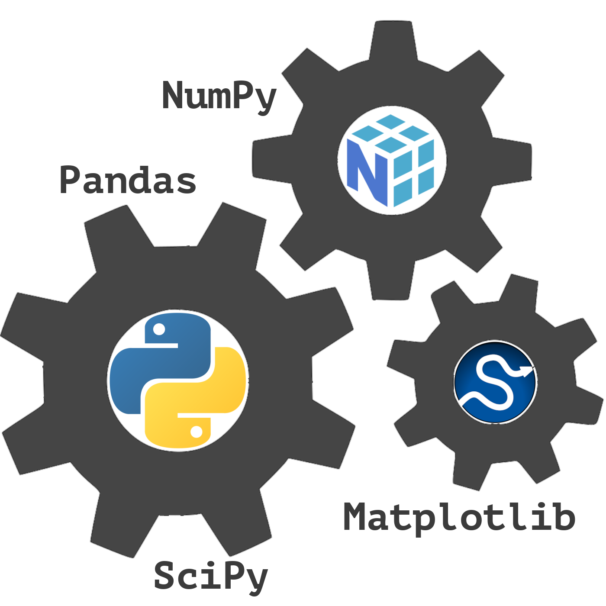

# Kurs: Statistik und Datenanalyse mit Python
## Einführung in die Module NumPy, Pandas, Matplotlib und SciPy

Die Programmiersprache Python hat sich im letzten Jahrzehnt zum meistgenutzten und beliebtesten Werkzeug für alle Aufgaben im Bereich, den man heute 'Data Science' nennt, entwickelt.

In diesem Kurs lernen wir nach einer sehr kurzen Einführung in Python die wichtigsten Module für das Arbeiten mit Daten sowie deren Visualisierung und statistischer Auswertung kennen. Hier stehen vor allem die vier Module NumPy, Pandas, Matplotlib und SciPy im Vordergrund.

**Was sollten Sie an Vorraussetzungen für den Kurs mitbringen?**
Dies ist keine Einführung in die Statistik! Sie sollten also über ein gewisses Wissen über einfachste statistische Konzepte verfügen. Gut wäre es sicherlich auch, wenn Sie schon einmal programmiert haben, oder sich in einer anderen Programmiersprache auskennen, die einen numerischen Zweck hat, wie z.B. Matlab, R, Julia o.ä.

## Nötige Vorbereitungen

Wir wollen in diesem Kurs mit der Python-Distribution [*Anaconda*](https://de.wikipedia.org/wiki/Anaconda_(Python-Distribution)) und [*Jupyter-Notebooks*](https://de.wikipedia.org/wiki/Project_Jupyter#Jupyter_Notebook) arbeiten. Nach wie vor ist es nicht trivial Python zu installieren. Anaconda hilft bei dieser Hürde und installiert dazu noch alle wichtigen Pakete im oben genannten Python Science-Stack. Weitere Pakete, die wir im Kurs brauchen, lassen sich dann leicht über das Kommandozeilen Programm `conda` nachinstallieren. Mit Jupyter-Notebooks lässt sich sehr gut "explorativ" arbeiten und der Code leicht mit anderen teilen. Auch dieser Kurs baut auf Jupyter-Notebooks auf (--> Dateien mit der Endung ".ipynb").

- Laden Sie sich [hier](https://www.anaconda.com/products/distribution) die Installationsdatei für Anaconda für ihr Betriebssystem herunter und installieren Sie es. Bei Problemen mit der Installation, schauen Sie bitte in die [Anaconda-Dokumentation](https://docs.anaconda.com/anaconda/install/).
- Laden Sie sich die hier gelisteteten ".ipynb" Dateien herunter. Wenn Sie mit [Git](https://git-scm.com/docs/git/de) vertraut sind, können Sie dieses Repository auch einfach [klonen](https://docs.github.com/en/repositories/creating-and-managing-repositories/cloning-a-repository). Dies ist die bevorzugte Weise, denn so sind sie automatisch nach jedem Pull-Request auf dem aktuellsten Stand.
- Starten Sie Anaconda-Navigator.
- Dort klicken Sie dann bei "Jupyter-Notebooks" auf "launch".
- Der Jupyter-Notebook Server startet sich und in ihrem Standardbrowser sollte sich ein Tab öffnen, in dem Sie zu den obigen Jupyter-Notebook Dateien navigieren können.

## Empfehlung

Zur besseren Navigation innerhalb der Notebook Dateien empfiehlt es sich die Ansicht eines *Inhaltsverzeichnisses* als Jupyter-Notebook Erweiterung zu installieren.

Dies ist leicht über das Kommandozeilenwerkzeug `conda` zu bewerkstelligen.

- Schlieẞen Sie einen eventuell laufenden Jupyter Server.
- Öffnen Sie ein Terminal und geben folgenden Befehl ein: `conda install -c conda-forge jupyter_contrib_nbextensions`.
- Danach starten Sie Jupyter über den Anaconda-Navigator erneut.
- Im darauf sich öffnenden Tab Ihres Browsers gibt es nun einen neuen "Unter-Tab" mit Namen *Nbextensions*.
- Dort aktivieren Sie die Checkbox bei *Table of Contents (2)*.
- Beenden Sie und starten Sie Jupyter erneut.
- Nun können Sie sich bei einem laufenden Notebook über einen neuen Button das Inhaltsverzeichnis anzeigen lassen.
- Weitere Infos dazu finden Sie [hier](https://jupyter-contrib-nbextensions.readthedocs.io/en/latest/nbextensions/toc2/README.html).